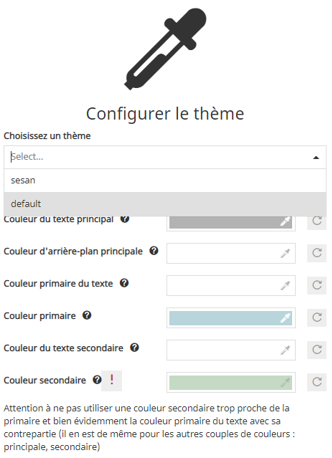

Developer Guide
===============
To start using the MapStore geOrchestra project as a developer you need the following:

 * install the needed requirements:
     * NodeJS (>=16)
     * JDK (>= 11)
     * Maven (>= 3.6)

 * clone the GitHub repository:

 .. code-block:: console

    git clone --recursive https://github.com/georchestra/mapstore2-georchestra

 * from the cloned source, install the dependencies from the npm registry:

 .. code-block:: console

    npm install

 * do a full build using the build script:

 .. code-block:: console

    ./build.sh

.. toctree::
   :maxdepth: 4

   ./integration/index

Configuring the backend
-----------------------

To develop locally you will need to use a proxied backend. To configure your backend of choice you need to properly change the webpack.config.js file,
in particular you need to change the following variables:

 * DEV_PROTOCOL: http or https
 * DEV_HOST: host and port of the backend

 .. code-block:: javascript

    const DEV_PROTOCOL = "http";
    const DEV_HOST = "localhost:8080";

You can either:
 * use an online backend
 * deploy and run your just build backend on a Tomcat instance

To deploy your local backend you will need to:

 * copy the mapstore.war from web/target to your Tomcat webapps folder
 * create a local geOrchestra datadir anywhere in your PC and copy the following inside it:

  * a standard geOrchestra ``default.properties`` file with generic configuration (database and LDAP settings for example)
  * the datadir/mapstore folder from web/target/geOrchestra with the mapstore specific configuration files
  * add the georchestra.datadir environment variable to the Tomcat setenv script to point to your datadir folder

 .. code-block:: console

    -Dgeorchestra.datadir=/etc/georchestra

 * properly change the configuration files, in particular to set the database and LDAP repository connection settings

If you don't have a local database and LDAP repository properly configured for geOrchestra you can use remote ones,
by configuring their access in ``web/src/main/resources/mapstore.properties``

Remember: to use a local backend both a PostgreSQL database and LDAP repository needs to be available and properly populated.

If you dont want to have a PostgreSQL database, you can fallback to h2 using this diff:

.. code-block:: diff
    :caption: web/src/main/resources/applicationContext.xml.diff
    @@ -127,15 +127,8 @@
                    <property name="ignoreUnresolvablePlaceholders" value="true"/>
            </bean>
         <bean id="georchestraDataSource" class="org.apache.commons.dbcp.BasicDataSource">
    -        <property name="driverClassName" value="org.postgresql.Driver" />
    -        <property name="url" value="jdbc:postgresql://${pgsqlHost:localhost}:${pgsqlPort:5432}/${pgsqlDatabase:georchestra}" />
    -        <property name="username" value="${pgsqlUser:postgres}" />
    -        <property name="password" value="${pgsqlPassword:}" />
    -        <property name="initialSize" value="${dataSource.initialSize:0}" />
    -        <property name="minIdle" value="${dataSource.minIdle:0}" />
    -        <property name="maxIdle" value="${dataSource.maxIdle:8}" />
    -        <property name="minEvictableIdleTimeMillis" value="${dataSource.minEvictableIdleTimeMillis:180000}" />
    -        <property name="timeBetweenEvictionRunsMillis" value="${dataSource.timeBetweenEvictionRunsMillis:3000}" />
    +        <property name="driverClassName" value="org.h2.Driver" />
    +        <property name="url" value="jdbc:h2:./test"/>
         </bean>
         <bean id="georchestraEntityManagerFactory"
                     class="org.springframework.orm.jpa.LocalContainerEntityManagerFactoryBean">
    @@ -155,7 +148,7 @@
                     <entry key="hibernate.connection.autocommit" value="true"/>
                     <entry key="hibernate.generate_statistics" value="false"/>
                     <entry key="hibernate.hbm2ddl.auto" value="update" />
    -                <entry key="hibernate.default_schema" value="${pgsqlGeoStoreSchema:geostore}" />
    +<!--                <entry key="hibernate.default_schema" value="${pgsqlGeoStoreSchema:geostore}" /> -->
                 </map>
             </property>
         </bean>

running the local backend with ``npm run backend:dev`` will create a new ``test.h2.db`` database in the tomcat root.

if you start the local backend outside of an existing tomcat instance, you should also set the ``georchestra.datadir``
property in the ``properties`` `section of web/pom.xml <https://github.com/georchestra/mapstore2-georchestra/blob/master/web/pom.xml#L20>`_, pointing at the full path of your local datadir.

Developing the frontend
-----------------------

To start the frontend locally, just run:

 .. code-block:: console

    npm start

Your application will be available at http://localhost:8081

If developing remotely, you can tell webpack to serve the files at a given hostname/ip, eg in `package.json <https://github.com/georchestra/mapstore2-georchestra/blob/master/package.json#L124>`_:

.. code-block:: diff
    :caption: package.json.diff

    -    "start": "webpack serve --progress --color --port 8081 --hot --inline --content-base .",
    +    "start": "webpack serve --progress --color --public my.georchestra.org --host 0.0.0.0 --port 8081 --hot --inline --content-base .",

will make it available at http://my.georchestra.org:8081

When doing modifications on the frontend code, ``webpack`` will automatically
rebundle the source and reload the page, no need to do that manually.

The only way to get *unminified* javascript debugguable via the browser console is to use ``npm start`` which uses the `debug configuration for webpack <https://github.com/georchestra/mapstore2-georchestra/blob/master/webpack.config.js>`_.

The `production configuration <https://github.com/georchestra/mapstore2-georchestra/blob/master/prod-webpack.config.js#L26>`_ minimises the javascript.

Mocking security
----------------

When working locally you won't have the security proxy authentication enabled, but you can simulate it using a specific
Chrome extension called ModHeader.

Install this extension and configure it to set the following request headers:

 * ``sec-username``: the username logged in
 * ``sec-roles``: a semicolon delimited list of roles (e.g. ROLE_MAPSTORE_ADMIN)

Remember to disable the extension when you don't need it.

Styling and theming
------------------

MapStore2 allow to `customize default theme or create new one <https://mapstore.readthedocs.io/en/latest/developer-guide/customize-theme/>`_.

You can either:
 * Custom or create a new theme to style a specific context
 * Change the default mapstore2 theme

Note that currently, only the webapp build process allow to compile ``themes/foo/foo.less`` files to ``.css`` files (see `lesscss.org <https://lesscss.org/>`_).

So, to create a new theme you have to :

 * Create a new folder in ``mapstore2-georchestra/themes`` (e.g ``/themes/foo``)
 * Copy and rename `dark <https://github.com/geosolutions-it/MapStore2/tree/c87f5fa9e5e744abc209d7a5e33b4682e22f04d9/web/client/themes/dark>`_ (or ``/themes/default``) folder to ``/themes/foo``
 * Open ``variable.less`` and custom styles rules
 * Build and deploy the web app (`see above <http://localhost/msdoc/developer/index.html#developer-guide>`_)
 * ``/dist/themes/{foo.css, foo.js}`` theme's files are fully available in the webapp

To use a theme in the context creator when you create or edit a context, open ``localConfig.json`` and add the theme in the ``contextCreator`` config :

 .. code-block:: json

    {
        "name": "ContextCreator",
        "cfg": {
            "themes":[
                {"id":"foo","type":"link","href":"dist/themes/foo.css"},
                {"id":"default","type":"link","href":"dist/themes/default.css"}
            ]
        }
    }

This theme is now available and you can custom it from ``the contextCreator`` UI :

Next, to change the default theme you have to open the ``localConfig.json`` and change ``defaultState.theme`` config (where ``foo`` is available as ``/dist/themes/foo/foo.css``):

 .. code-block:: json

    "defaultState": {
        "theme":{
          "selectedTheme":{
            "id": "foo"
          }
        }
    }
