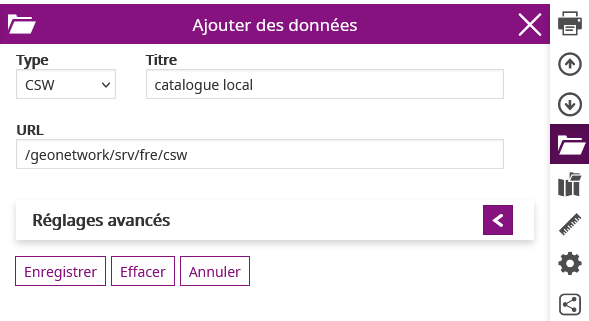

# Configuration du catalogue de services

La documentation officielle est [ici](https://mapstore2.readthedocs.io/en/latest/user-guide/catalog/).

Le catalogue de MapStore est une fonctionnalité très importante car elle permet d'offrir aux utilisateurs la possibilité d'aller chercher puis charger des données exposées au travers des protocoles / standars suivants :

* CSW
* WMS
* WMTS
* TMS
* COG


## Service CSW

Le Catalog Service for the Web (CSW) est une norme OGC utilisée pour publier et rechercher des données géospatiales et les métadonnées associées sur Internet.

GeoNetwork est le module de geOrchestra qui permet de stocker, modifier et diffuser des métadonnées. Pour l'interroger, il faut donc utiliser le protocole CSW.

### Ajouter

Pour ajouter un catalogue CSW, simplement cliquer sur le "+" du catalogue puis configurer en donnant un nom puis une URL simple comme ceci :




### Réglages avancés

Il est recommandé de configurer par défaut un filtre statique et un filtre dynamique.

Ces 2 filtres permettent de restreindre ou d'étendre la recherche qui est basée sur la saisie de mots. Les temps de réponse peuvent être très différents.

Recommandation de filtre statique :

```xml
<ogc:Or>
  <ogc:PropertyIsEqualTo matchCase='true'>
    <ogc:PropertyName>Type</ogc:PropertyName>
    <ogc:Literal>data</ogc:Literal>
  </ogc:PropertyIsEqualTo>
  <ogc:PropertyIsEqualTo matchCase='true'>
    <ogc:PropertyName>Type</ogc:PropertyName>
    <ogc:Literal>dataset</ogc:Literal>
  </ogc:PropertyIsEqualTo>
  <ogc:PropertyIsEqualTo matchCase='true'>
    <ogc:PropertyName>Type</ogc:PropertyName>
    <ogc:Literal>datasetcollection</ogc:Literal>
  </ogc:PropertyIsEqualTo>
  <ogc:PropertyIsEqualTo matchCase='true'>
    <ogc:PropertyName>Type</ogc:PropertyName>
    <ogc:Literal>series</ogc:Literal>
  </ogc:PropertyIsEqualTo>
</ogc:Or>
```

Cette requête CSW restreint donc la recherche par défaut sur des métadonnées de type :

* "data"
* "dataset" (jeux de données)
* "datasetcollection" (ensemble / collection de données)


Recommandation de filtre dynamique :

```xml
<ogc:Or>
  <ogc:PropertyIsLike matchCase='false' wildCard='*' singleChar='.' escapeChar='!'>
    <ogc:PropertyName>Title</ogc:PropertyName>
    <ogc:Literal>${searchText}*</ogc:Literal>
  </ogc:PropertyIsLike>
  <ogc:PropertyIsLike matchCase='false' wildCard='*' singleChar='.' escapeChar='!'>
    <ogc:PropertyName>AlternateTitle</ogc:PropertyName>
    <ogc:Literal>${searchText}*</ogc:Literal>
  </ogc:PropertyIsLike>
  <ogc:PropertyIsLike matchCase='false' wildCard='*' singleChar='.' escapeChar='!'>
    <ogc:PropertyName>Abstract</ogc:PropertyName>
    <ogc:Literal>${searchText}*</ogc:Literal>
  </ogc:PropertyIsLike>
  <ogc:PropertyIsLike matchCase='false' wildCard='*' singleChar='.' escapeChar='!'>
    <ogc:PropertyName>Subject</ogc:PropertyName>
    <ogc:Literal>${searchText}*</ogc:Literal>
  </ogc:PropertyIsLike>
  <ogc:PropertyIsLike matchCase='false' wildCard='*' singleChar='.' escapeChar='!'>
    <ogc:PropertyName>Description</ogc:PropertyName>
    <ogc:Literal>${searchText}*</ogc:Literal>
  </ogc:PropertyIsLike>
  <ogc:PropertyIsLike matchCase='false' wildCard='*' singleChar='.' escapeChar='!'>
    <ogc:PropertyName>Source</ogc:PropertyName>
    <ogc:Literal>${searchText}*</ogc:Literal>
  </ogc:PropertyIsLike>
  <ogc:PropertyIsLike matchCase='false' wildCard='*' singleChar='.' escapeChar='!'>
    <ogc:PropertyName>OrganisationName</ogc:PropertyName>
    <ogc:Literal>${searchText}*</ogc:Literal>
  </ogc:PropertyIsLike>
</ogc:Or>
```

Avec cette requête, les mots-clés seront spécifiquement cherchés dans les descripteurs Title, AlternateTitle, Abstract, Subject, Description, Source et OrganisationName des métadonnées.


## Service WMS

TODO

## Service WMTS

TODO

## Service TMS

TODO

## Service COG

TODO
