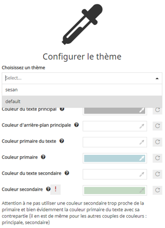

# Guide développeur

Pour travailler localement sur `mapstore2-georchestra`, il faut :

- Node.js
- JDK 8 ou plus récent
- Maven 3.x

Cloner le dépôt avec ses sous-modules :

```console
git clone --recursive https://github.com/georchestra/mapstore2-georchestra
```

Installer les dépendances frontend :

```console
npm install
```

Lancer une construction complète :

```console
./build.sh
```

## Préparer le backend pour le développement

Le développement local s'appuie généralement sur un backend proxifié. Mettez à jour `webpack.config.js` pour pointer vers le backend souhaité :

```javascript
const DEV_PROTOCOL = "http";
const DEV_HOST = "localhost:8080";
```

Vous pouvez soit travailler avec un backend distant existant, soit déployer votre backend construit localement dans Tomcat.

Pour un backend local :

- copier `mapstore.war` depuis `web/target/` vers le répertoire `webapps/` de Tomcat
- créer un répertoire de données geOrchestra local
- y copier un `default.properties` standard
- y copier le répertoire `mapstore/` généré sous `web/target/geOrchestra/`
- définir l'option JVM `-Dgeorchestra.datadir=/etc/georchestra`
- ajuster les paramètres de base de données et LDAP

Si vous n'avez pas de base PostgreSQL locale ni d'annuaire LDAP local, vous pouvez pointer le backend vers des services distants.

## Développement frontend

Démarrer le frontend avec :

```console
npm start
```

L'application est alors disponible sur `http://localhost:8081`.

## Simuler les en-têtes de sécurité

Quand le proxy de sécurité geOrchestra n'est pas présent en local, vous pouvez simuler ses en-têtes avec une extension de navigateur comme ModHeader.

Définissez :

- `sec-username` : le nom de l'utilisateur authentifié
- `sec-roles` : la liste des rôles séparés par des points-virgules, par exemple `ROLE_MAPSTORE_ADMIN`

Pensez à désactiver l'extension quand vous n'en avez plus besoin.

## Style et thèmes

MapStore2 permet de personnaliser le thème par défaut ou d'en créer un nouveau.

- créer un nouveau répertoire sous `themes/`, par exemple `themes/foo`
- copier un thème de référence comme `dark` ou `default`
- modifier `variables.less` et les styles associés
- reconstruire et redéployer la webapp
- utiliser les fichiers générés dans `dist/themes/`

Pour rendre un thème disponible dans le créateur de contexte, ajoutez-le à la liste `contextCreator.themes` de `localConfig.json` :

```json
{
  "name": "ContextCreator",
  "cfg": {
    "themes": [
      {"id": "foo", "type": "link", "href": "dist/themes/foo.css"},
      {"id": "default", "type": "link", "href": "dist/themes/default.css"}
    ]
  }
}
```

Le thème peut alors être sélectionné depuis l'interface du créateur de contexte.



Pour en faire le thème par défaut, mettez à jour `defaultState.theme.selectedTheme.id` dans `localConfig.json`.
