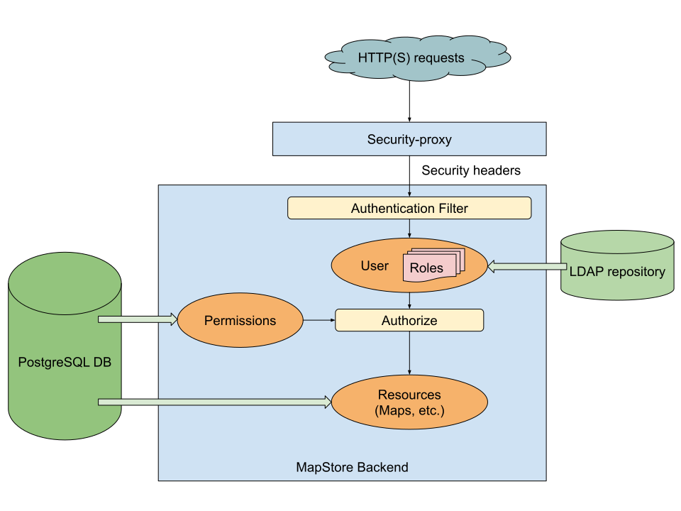
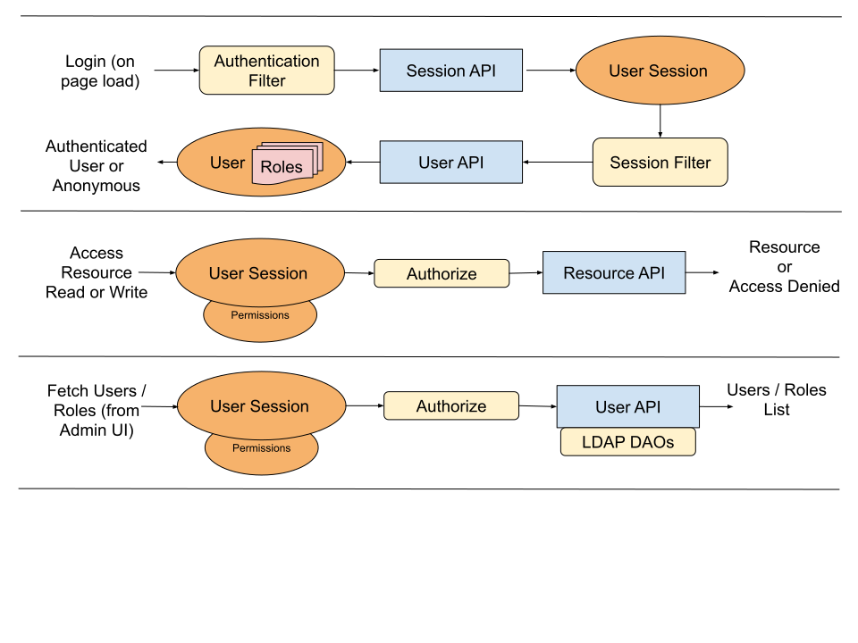

# Intégration avec geOrchestra

L'intégration de MapStore dans une IDS geOrchestra repose sur les briques externes suivantes :

- [Bandeau](https://github.com/georchestra/georchestra/blob/master/header/src/main/webapp/WEB-INF/jsp/index.jsp)
- [Traductions du bandeau](https://github.com/georchestra/georchestra/tree/master/header/src/main/resources/_header/i18n)
- [Scripts de création de base](https://github.com/georchestra/georchestra/blob/master/postgresql/110-mapstore.sql)
- [Docker](https://github.com/georchestra/docker/blob/master/docker-compose.yml#L153)
- [Répertoire de données](https://github.com/georchestra/datadir/tree/master/mapstore)
- [Workflows GitHub](https://github.com/georchestra/mapstore2-georchestra/blob/master/.github/workflows/mapstore.yml)

## Intégration avec la sécurité

MapStore est intégré à l'infrastructure de sécurité geOrchestra grâce à :

- un filtre d'authentification qui lit les en-têtes transmis par le proxy de sécurité geOrchestra
- des DAO connectés à LDAP pour récupérer les utilisateurs et les rôles depuis l'annuaire geOrchestra

## Filtre d'authentification

Le filtre d'authentification intercepte chaque requête backend de MapStore afin d'extraire les en-têtes transmis par le security proxy et de les utiliser pour authentifier et autoriser l'utilisateur courant.

En particulier :

- `sec-username` est utilisé pour authentifier l'utilisateur courant
- `sec-roles` est utilisé pour affecter des groupes MapStore à l'utilisateur courant
- `MAPSTORE_ADMIN` est mappé vers le rôle MapStore `ADMIN`

Le filtre est configuré dans `geostore-security-proxy.xml` :

```xml
<security:http auto-config="true" create-session="never">
    ...
    <security:custom-filter ref="headersProcessingFilter" before="FORM_LOGIN_FILTER"/>
    ...
</security:http>

<bean id="georchestraAuthenticationProvider"
    class="it.geosolutions.geostore.services.rest.security.PreAuthenticatedAuthenticationProvider">
</bean>

<bean class="it.geosolutions.geostore.services.rest.security.HeadersAuthenticationFilter"
    id="headersProcessingFilter">
    <property name="addEveryOneGroup" value="true"/>
    <property name="usernameHeader" value="sec-username"/>
    <property name="groupsHeader" value="sec-roles"/>
    <property name="listDelimiter" value=";"/>
    <property name="authoritiesMapper" ref="rolesMapper"/>
</bean>

<bean id="rolesMapper" class="it.geosolutions.geostore.core.security.SimpleGrantedAuthoritiesMapper">
    <constructor-arg>
        <map>
            <entry key="MAPSTORE_ADMIN" value="ADMIN"/>
        </map>
    </constructor-arg>
</bean>
```

## Intégration LDAP

MapStore est intégré à l'annuaire LDAP de geOrchestra afin d'exposer les utilisateurs et les rôles de manière cohérente dans l'interface d'administration et de les utiliser pour affecter des permissions sur les ressources comme les cartes et les contextes.

Cette intégration est également configurée dans `geostore-security-proxy.xml` :

```xml
<bean id="ldap-context" class="org.springframework.security.ldap.DefaultSpringSecurityContextSource">
    <constructor-arg value="${ldapScheme}://${ldapHost}:${ldapPort}/${ldapBaseDn}" />
    <property name="userDn" value="${ldapAdminDn}"/>
    <property name="password" value="${ldapAdminPassword}"/>
</bean>
<bean id="ldapUserDAO" class="it.geosolutions.geostore.core.dao.ldap.impl.UserDAOImpl">
    <constructor-arg ref="ldap-context"/>
    <property name="searchBase" value="${ldapUsersRdn}"/>
    <property name="memberPattern" value="^uid=([^,]+).*$"/>
    <property name="attributesMapper">
        <map>
            <entry key="mail" value="email"/>
            <entry key="givenName" value="fullname"/>
            <entry key="description" value="description"/>
        </map>
    </property>
</bean>
<bean id="ldapUserGroupDAO" class="it.geosolutions.geostore.core.dao.ldap.impl.UserGroupDAOImpl">
    <constructor-arg ref="ldap-context"/>
    <property name="searchBase" value="${ldapRolesRdn}"/>
    <property name="addEveryOneGroup" value="true"/>
</bean>
<alias name="ldapUserGroupDAO" alias="userGroupDAO"/>
<alias name="ldapUserDAO" alias="userDAO"/>
```

Les paramètres de connexion LDAP sont lus depuis le fichier geOrchestra `default.properties` puis mappés vers des variables internes comme `${ldapHost}`.

Pour configurer l'emplacement de `default.properties`, geOrchestra utilise la variable d'environnement standard `georchestra.datadir`.
En développement local, la JVM doit typiquement recevoir :

```console
-Dgeorchestra.datadir=/etc/georchestra
```

## Schémas d'architecture

Les schémas suivants résument le fonctionnement des briques liées à la sécurité :




