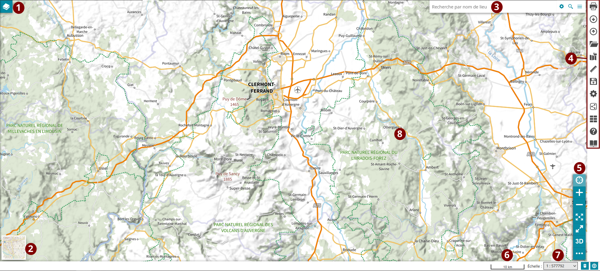

# Vue globale

la vue globale apparaît lorsque l'on ouvre Mapstore, avec encards ou numéros localisant et nommant les différents outils décrits dans les différentes parties.

Exemple de vue globale Mapstore2 :

1. Liste des couches (cliquer pour la déplier)

2. Liste des fonds de plans référentiels (cliquer sur la vignette pour déplier et accéder aux fonds de plan)

3. Zone de recherche pour se localiser

4. Barre d'outils

5. Barre de navigation (le bouton [...] permet d'accéder à des outils cachés par défaut)

6. Échelle graphique courante de la carte

7. Échelle numérique courante de la carte calée sur le système de tuiles d'images (impossible d'avoir une échelle ronde – choisir une échelle dans la liste déroulante)

8. Contenu de la carte

