# How to create a template map in MapStore?

We suggest creating the map template in 3 steps:

* Create the map
* Promote it to a map template
* Make it accessible to MapStore users

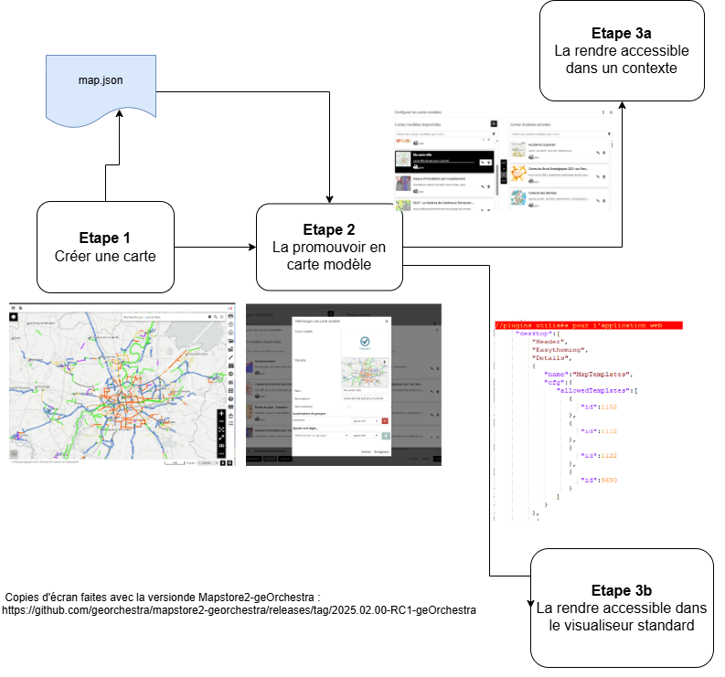

## Step 1: Create a Map

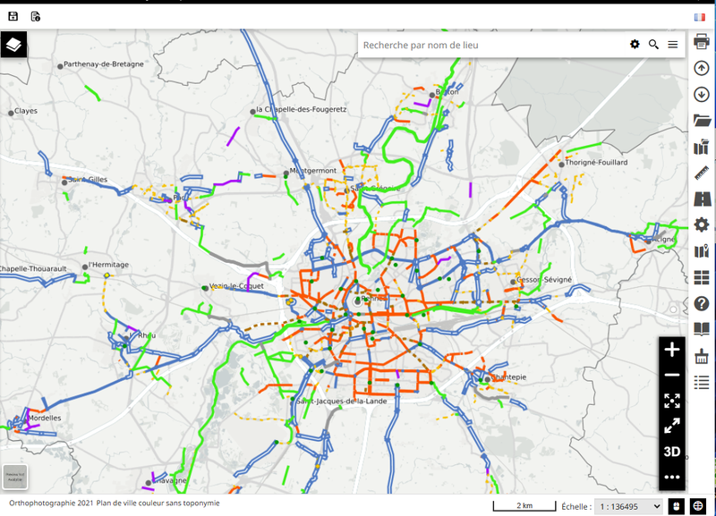

From the standard viewer /mapstore, create a map:

* Add the desired data to the TOC (layer list)
* Organize them as needed: create layer groups, etc.
* Add the necessary basemaps (background layers)
* Position the map at the desired location (extent). 

Once the map is ready, export it in JSON format.

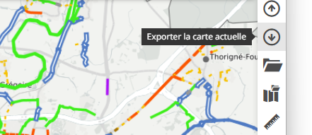

**_Result_**: You now have a map.json file.

## Step 2: Promote It to a Map Template

From any context, integrate the map so it gets promoted as a map template.

* Go to the "Applications" tab
* Filter the objects to show only contexts

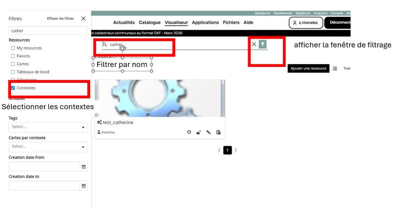

* Open any context (preferably one where you want to load the map template) in edit mode
* Select the "Map Template" plugin
* Open the list of map templates

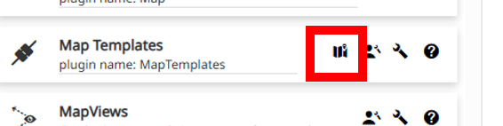

* Load the map.json file

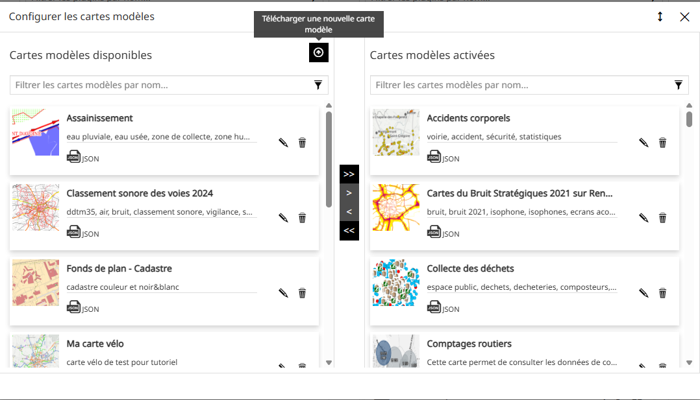

* Fill in the map template parameters and save

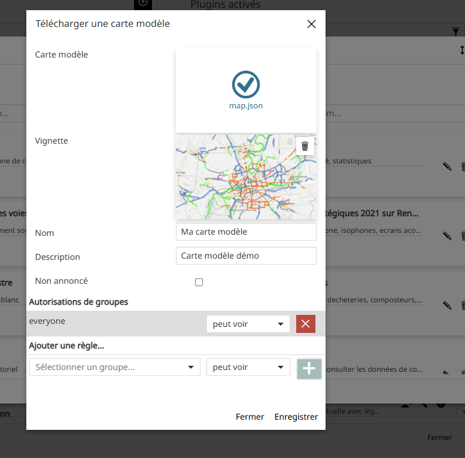

**_Result_**: The map is loaded into the MapStore database. It appears in the list of map templates and can be used in any context and/or in the standard viewer (/mapstore).

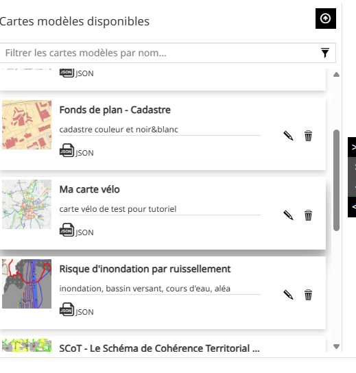

## Step 3: Make It Accessible to Users

### 3.a From a Context

In a given context, you can add the map to the "Map Template" plugin by simply dragging the newly created map template into the list of map templates used by the context. Save the context.

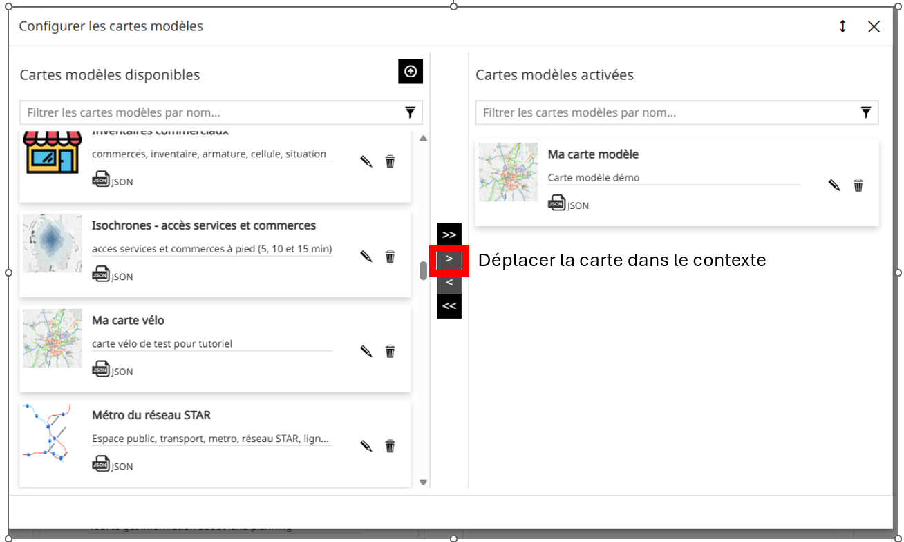

N**_Note_**: Any update to the map template will automatically apply to all contexts where it is loaded.

**_Result_**: The map template is available to users in the context where you just added it.

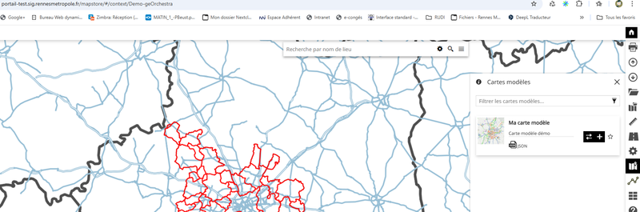

### 3.b From the Standard Viewer
For the map template to be available in the standard MapStore viewer (/mapstore), you need to add its identifier in the desktop section of the localConfig.json file.

#### How to retrieve its identifier?

You can get it from the browser console by following these steps:

* Open the context where you added the map template as a user
* Open the browser console in "Network" mode to monitor the traffic
* Load the map template and identify the number of the request used to load the map (in the example below, it's number 9133)

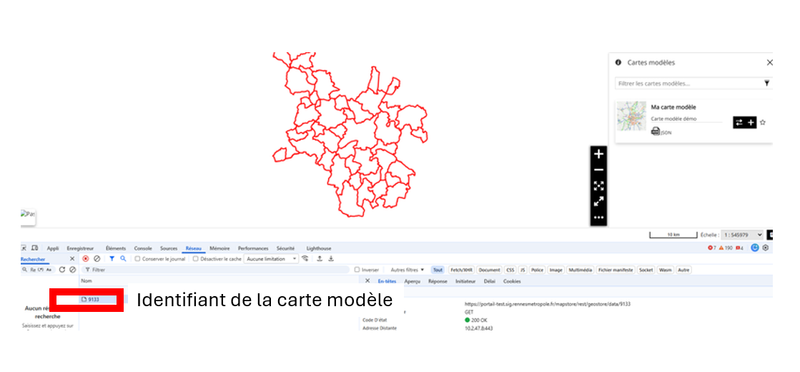

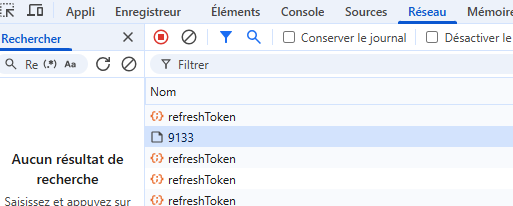

#### How to add it in localConfig.json?

The localConfig.json file in MapStore contains the plugin settings for the standard MapStore viewer (/mapstore). You need to modify it.

Steps:

* Open localConfig.json for editing
* Navigate to the Desktop section in the MapTemplate plugin (add it if it's missing) and add the map template identifier at the end of the parameter

Example:

json
```


{
    "name": "MapTemplates",
    "cfg": {
        "allowedTemplates": [
            { "id": 1035 },
            { "id": 9077 },
            { "id": 9055 },
            { "id": 9133 }
        ]
    }
}`
```


**_Result_**: The map template is available to users in the standard MapStore viewer.

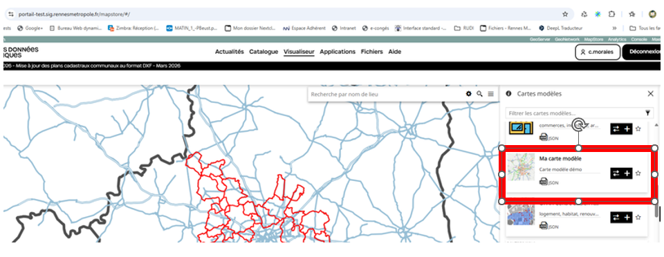
