# Comment créer une carte modèle dans Mapstore ?

On propose de créer la carte modèle en 3 étapes:

- créer la carte,
- la promouvoir en carte modèle,
- la rendre accessible aux utilisateurs de Mapstore.

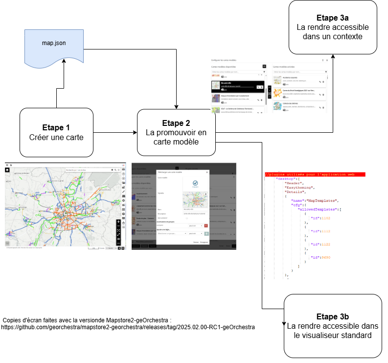


## Etape 1 : créer une carte

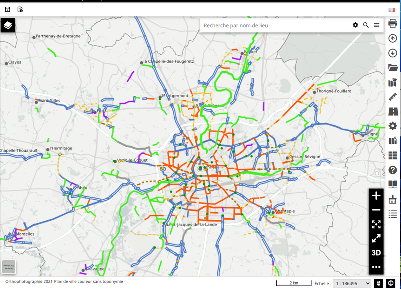

Depuis le visualiseur standard /mapstore, créer une carte :

- ajouter les données souhaitées dans la TOC (liste des couches),
- les organiser comme souhaitées : création de groupes de couches, ...
- ajouter les fonds de plans nécessaires (backgroundlayers).
- se positionner dans la carte à l'endroit voulu (emprise).
Une fois la carte prête l'exporter au format JSON.

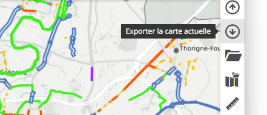

**_Résultat_** : on dispose d'un fichier map.json

## Etape 2: la promouvoir en carte modèle

Depuis n'importe quel contexte, intégrer la carte pour qu'elle soit promue en tant que carte modèle (map template).

- aller dans l'onglet "Applications",
- filtrer les objets pour ne voir que les contextes,

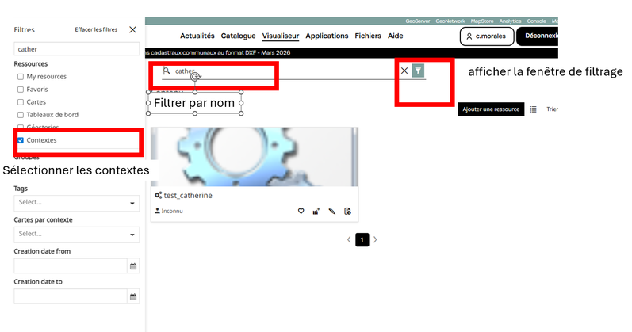

- ouvrir n'importe quel contexte ( de préférence un contexte où l'on souhaite charger la carte modèle) en modification,
- sélectionner le plugin "Map Template"
- ouvrir la liste des cartes modèles

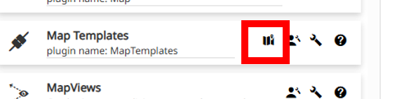

- charger le fichier map.json,

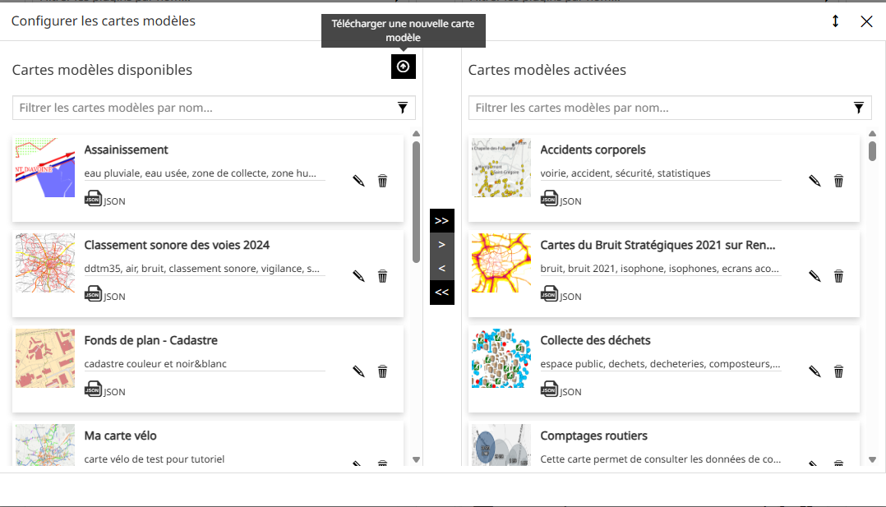

- renseigner les paramètres de la carte modèle et enregistrer 

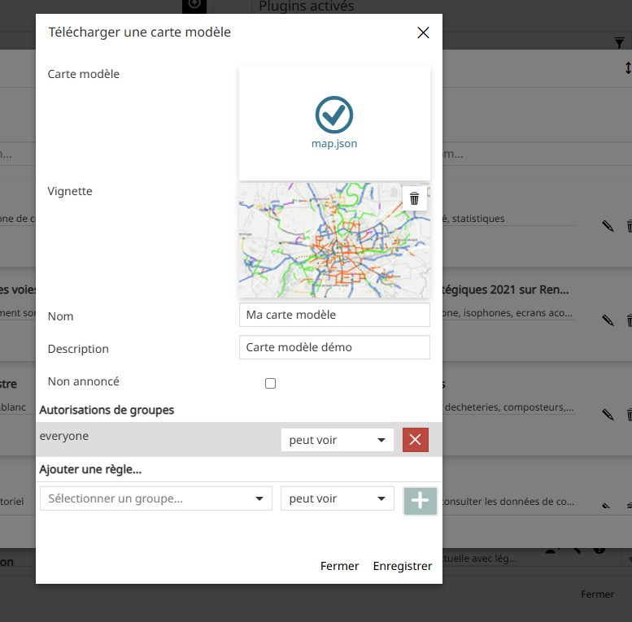

**_Résultat_** : la carte est chargée dans la base de données mapstore, elle apparait dans la liste des cartes modèles  et peut être utilisée dans n'importe quel contexte, et/ou dansle visualiseur standard (/mapstore).

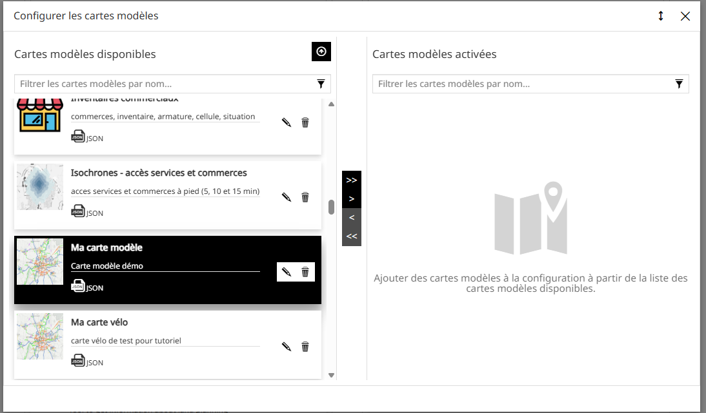

## Etape 3: la rendre accessible aux utilisateurs

### 3.a  Depuis un contexte

Dans un contexte donné, on peut ajouter la carte dans le plugin "Map Template" en glissant simplement la carte modèle que l'on vient de créer dans la liste des cartes modèles utilisées par le contexte.
Enregistrer le contexte.

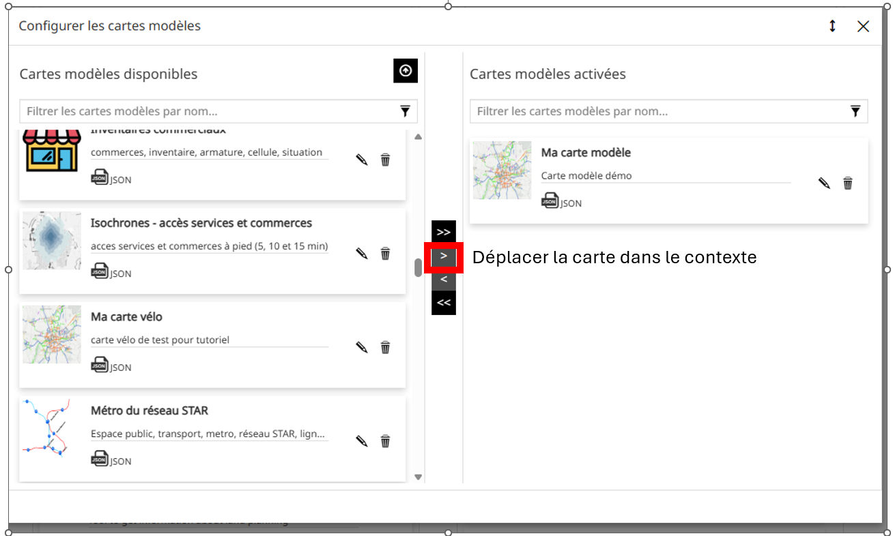

**_Noter_** : une mise à jour de la carte modèle s'appliquera automatiquement sur tous les contextes où elle est chargée.

**_Résultat_** :  la carte modèle est disponible aux utilisateurs dans le contexte où on vient  de l'ajouter.

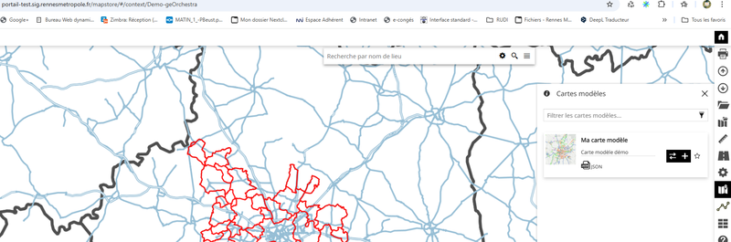


### 3.b Depuis le visualiseur standard

Pour que la carte modèle soit disponible dans le visualiseur standard de Mapstore (/mapstore), il est nécessaire d'ajouter son identifiant dans la section desktop du fichier localConfig.json.

#### Comment récupérer son identifiant ?

 Il est possible de le récupérer dans la console du navigateur en suivant les étapes suivantes:
 - ouvrir le contexte où on a rajouté la carte modèle en tant qu'utilisateur,
 - ouvrir la console du navigateur en mode "Réseau" pour voir passer les flux
 - charger la carte modèle et identifier le numéro du flux qui passe pour charger la carte (dans l'exemple ci-dessous c'est le numéro 9133)
  Exemple:

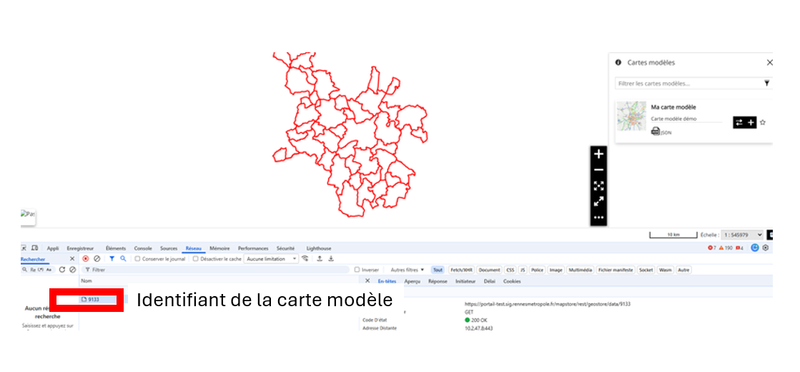

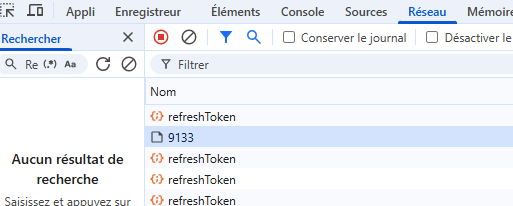

#### Comment l'ajouter dans le localConfig.json ?

Le fichier localConfig.json de Mapstore contient les paramétrages des plugins du visualiseur Mapstore standard (/mapstore).
Il faut donc le modifier. 

Les étapes sont donc :

- ouvrir localConfig.json en mise à jour
- se déplacer sur la section Desttop dans le plugin Maptemplate (l'ajouter si il est absent) et ajouter l'identifiant de la carte modèle en fin de paramètre.


Ex:
```
           {

                    "name": "MapTemplates",
                    "cfg": {
                        "allowedTemplates": [{

                                "id": 1035
                            }, {

                                "id": 9077
                            },{

                                "id": 9055
                            },{

                                "id": 9133
                            }


                        ]
                    }
                },

```

**_Résultat_** :  la carte modèle est disponible aux utilisateurs dans le visualiseur stansard de Mapstore.

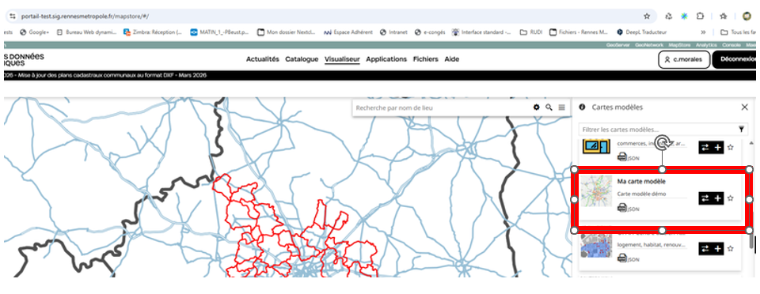
